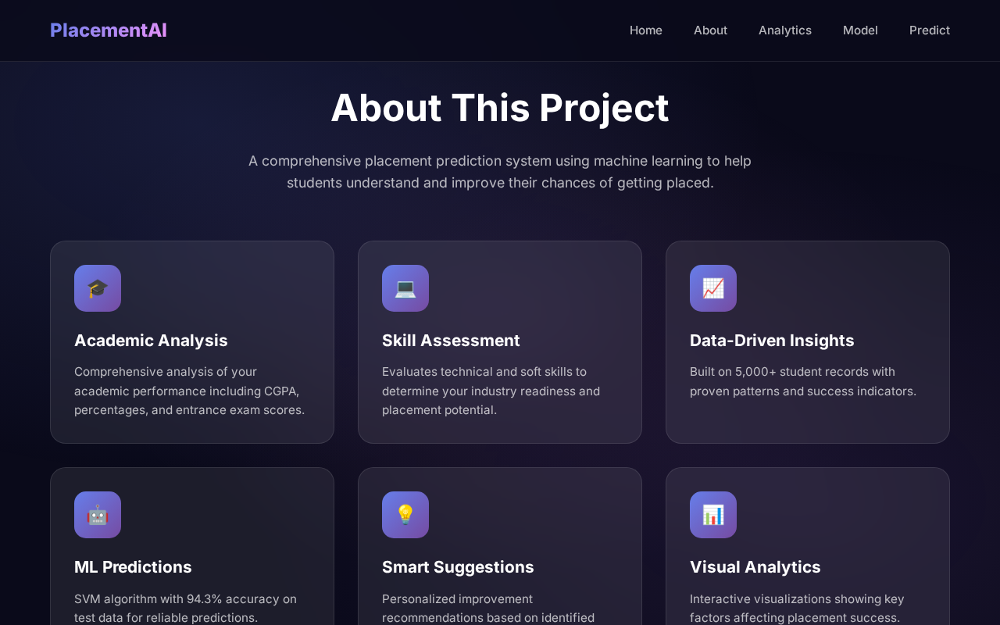
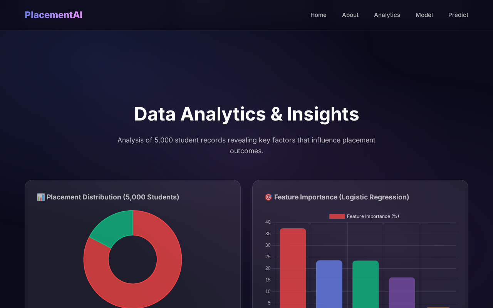

# 🎓 Placement Predictor Model


A full-stack application that leverages Machine Learning to predict student placement outcomes based on academic performance, technical skills, and extracurricular activities. It provides personalized feedback, actionable suggestions, and a probabilistic placement score.

## 🚀 Live Demo

**[Placement Predictor App](https://placement-predictor-model-git-main-pratik-raths-projects.vercel.app/)**

## ✨ Key Features

- **Predictive Analytics:** Calculates a placement probability score utilizing a robust Machine Learning model (Support Vector Machine) trained on comprehensive student data.
- **Personalized Suggestions:** Offers actionable, prioritized feedback based on critical factors like backlogs, internships, CGPA, and technical skills to improve placement chances.
- **Interactive UI:** Built with React, featuring a clean, responsive interface, animations (Framer Motion), and dynamic charts (Chart.js) to visualize data effectively.
- **Feature Importance:** Highlights the most significant factors influencing placement success (e.g., Backlogs, Technical Skills, Internships).
- **Comprehensive EDA:** Explains the underlying data through exploratory data analysis metrics, helping users understand general placement trends.

## 📸 Visual Elements & Screenshots

Here are some of the key sections of the application:

### 1. Hero Section & Dashboard

*The landing page providing an overview of the predictor and quick access to the prediction form.*

### 2. Prediction Form

*An intuitive form where students input their academic details, test scores, and project experience.*

### 3. Analytics & EDA

*Exploratory Data Analysis insights and placement statistics derived from the model data.*

## 🛠️ Tech Stack

### Frontend
- **React.js** (Vite for fast builds)
- **Chart.js** & **react-chartjs-2** (Data visualization)
- **Framer Motion** (Animations)
- **react-confetti** (Success celebrations)

### Backend
- **FastAPI** (High-performance Python API)
- **Uvicorn** (ASGI server)
- **Pydantic** (Data validation)

### Machine Learning
- **Scikit-Learn** (Model training, evaluation, and scaling)
- **Pandas & NumPy** (Data manipulation)
- **Pickle** (Model serialization)

## 📁 Project Structure

```bash
placement-predictor/
├── api/                  # FastAPI Backend
│   ├── app.py            # Main API application & endpoints
│   └── requirements.txt  # Python dependencies for API
├── data/                 # Datasets
│   └── student_academic_placement_performance_dataset.csv
├── ml/                   # Machine Learning Scripts
│   ├── train_models.py   # Training pipeline & evaluation
│   └── requirements.txt  # Python dependencies for ML
├── model/                # Serialized Models & Artifacts
│   ├── best_model.pkl    # Trained SVM Model
│   ├── scaler.pkl        # Feature scaler
│   ├── label_encoders.pkl# Categorical encoders
│   └── model_info.json   # Model performance metrics
├── public/               # Static assets
│   └── assets/           # Application screenshots
├── src/                  # React Frontend
│   ├── components/       # UI Components (Hero, Predictor, ModelInfo, etc.)
│   ├── styles/           # CSS stylesheets
│   ├── App.jsx           # Main React component
│   └── main.jsx          # React entry point
├── index.html            # HTML template
├── package.json          # Node.js dependencies
└── vite.config.js        # Vite configuration
```

## 🧠 Machine Learning Model Details

The application evaluates several models before selecting the best performer. Based on our evaluation:

- **Best Model:** Support Vector Machine (SVM)
- **Accuracy:** 94.3%
- **F1-Score:** 82.46%
- **ROC-AUC:** 97.84%

Other models evaluated include Logistic Regression (89.1% Acc), Random Forest (Overfitted), and K-Nearest Neighbors (90.2% Acc). The model takes 15 key features into account, prioritizing academic consistency and practical experience.

## 💻 Installation & Local Setup

Follow these steps to run the project on your local machine.

### Prerequisites
- Node.js (v16 or higher)
- Python (v3.8 or higher)

### 1. Clone the repository
`git clone https://github.com/your-username/placement-predictor.git`
`cd placement-predictor`

### 2. Frontend Setup
Install Node dependencies and start the Vite development server:
`npm install`
`npm run dev`

The frontend will typically run on `http://localhost:5173`.

### 3. Backend Setup
Open a new terminal window, navigate to the `api` directory, set up a virtual environment, and run the FastAPI server:

`cd api`
`python -m venv venv`

Activate virtual environment:
On Windows:
`venv\Scripts\activate`
On macOS/Linux:
`source venv/bin/activate`

Install dependencies:
`pip install -r requirements.txt`

Start the FastAPI server:
`python app.py`

The backend API will run on `http://localhost:8000`.

### 4. (Optional) Retrain the Model
If you wish to retrain the machine learning models with new data:
`cd ml`
`pip install -r requirements.txt`
`python train_models.py`

## 📡 API Endpoints

The FastAPI backend exposes the following endpoints:
- `GET /` - API health check.
- `POST /predict` - Accepts student data and returns the placement prediction, probability, and personalized suggestions.
- `GET /model-info` - Returns evaluation metrics of the deployed machine learning model.
- `GET /feature-importance` - Returns the top factors influencing placement predictions.

## 🤝 Contributing

Contributions, issues, and feature requests are welcome!
Feel free to check the [issues page](../../issues).

## 📝 License

This project is open-source and available under the [MIT License](LICENSE).
